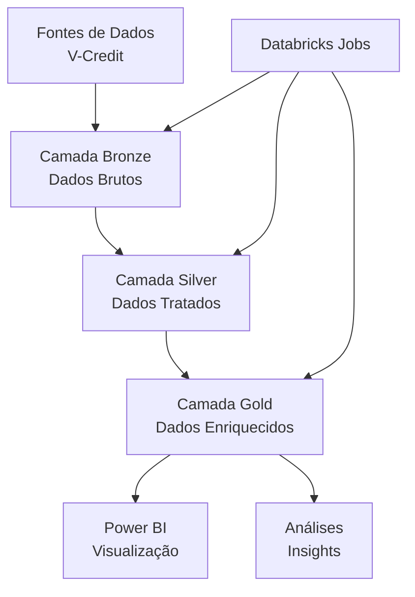

# 🚀 **Case V-Credit – Rocket Lab 2025**

  
  
  
  
  

  

  <a href="#-sobre-o-case">Sobre o Case</a> •
  <a href="#-abordagem-da-equipe-rocket">Abordagem</a> •
  <a href="#-arquitetura-de-dados">Arquitetura</a> •
  <a href="#-entregas-técnicas">Entregas Técnicas</a> •
  <a href="#-análises-e-insights">Análises</a> •
  <a href="#-equipe">Equipe</a> •
  <a href="#-próximos-passos">Próximos Passos</a>

---

## 📋 **Sobre o Case**

A **V-Credit** é uma empresa brasileira do setor financeiro que enfrenta desafios significativos em sua operação de atendimento ao cliente devido à crescente digitalização do setor. O volume de atendimentos aumentou expressivamente, sobrecarregando os sistemas existentes e resultando em:

- 📉 **Experiência do cliente abaixo das expectativas**
- 📈 **Custos operacionais elevados**
- 🔄 **Sistemas de dados fragmentados e inconsistentes**
- 🗣️ **Queda na satisfação do cliente**

**Nosso objetivo** é implementar uma transformação digital no atendimento, unindo **engenharia de dados** e **análise estratégica** para criar uma operação mais eficiente, com dados confiáveis e insights acionáveis.

---

## 🎯 **Abordagem da Equipe Rocket**

Nossa estratégia combina excelência técnica com profundidade analítica:

### **🔧 Pilares Técnicos**
- Implementação de **Medallion Architecture** para governança de dados
- Automação de pipelines com **Databricks Jobs**
- Garantia de qualidade e rastreabilidade dos dados
- Preparação para escalabilidade futura

### **📊 Pilares Analíticos**
- Análise do funil de atendimento atual vs. ideal
- Identificação de gargalos operacionais
- Proposta de melhorias baseadas em dados
- Métricas de negócio orientadas a resultados

---

## 🏗️ **Arquitetura de Dados**

Implementamos uma arquitetura moderna e escalável seguindo o padrão **Medallion**:

### **🥉 Camada Bronze**
- Ingestão das 8 bases originais da V-Credit
- Preservação integral dos dados brutos
- Registro de metadados e procedência

### **🥈 Camada Silver**
- Limpeza e padronização de dados
- Tratamento de valores nulos e inconsistências
- Deduplicação e enriquecimento básico
- Validação de integridade referencial

### **🥇 Camada Gold**
- Agregações estratégicas de negócio
- KPIs de atendimento consolidados
- Visões analíticas para tomada de decisão
- Métricas de eficiência operacional

---

## ⚙️ **Entregas Técnicas**

### **📓 Notebooks Databricks**
- `01_bronze_ingestion`: Ingestão das bases originais
- `02_silver_processing`: Tratamento e limpeza
- `03_gold_aggregation`: Modelagem dimensional
- `04_kpi_calculation`: Cálculo de métricas estratégicas

### **🔁 Pipelines Automatizados**
- Jobs configurados para atualização recorrente
- Monitoramento de qualidade de dados
- Alertas para inconsistências críticas

### **📈 Painel de Indicadores**
Principais métricas implementadas:
- **Tempo Médio de Atendimento** por canal e nível
- **Taxa de Resolução** na primeira interação
- **Custo por Atendimento** detalhado
- **Satisfação do Cliente** por motivo e canal
- **Eficiência da URA e Chatbot**
- **Conversão entre níveis do funil**

---

## 📊 **Análises e Insights**

### **🎯 Foco Estratégico**
Nossas análises respondem perguntas críticas do negócio:

- **Onde estão os maiores gargalos** no atendimento atual?
- **Quais canais** geram melhor custo-benefício?
- **Quais motivos** de atendimento mais impactam a satisfação?
- **Como reduzir** a migração para níveis especializados?
- **Onde investir** para maior retorno em experiência do cliente?

### **🔍 Insights Principais**
*(A serem desenvolvidos com base nos dados)*
- Padrões de sazonalidade no volume de atendimentos
- Correlação entre tempo de espera e satisfação
- Eficácia comparativa entre URA e Chatbot
- Impacto financeiro da resolução em primeiro contato

---

## 👥 **Equipe Rocket**

| | Integrante | Função Principal | Especialidades |
| :---: | :--- | :--- | :--- |
|  | **Thomaz Lima** [📧](mailto:trl@cesar.school) | Modelagem Analítica | Engenharia de Dados, Arquitetura |
|  | **João Vitor Coutinho** [📧](mailto:joaovitorx123@gmail.com) | Processamento de Dados | ETL, Qualidade de Dados |
|  | **Giovanny Lira** [📧](mailto:giovannyaraujo29@gmail.com) | Modelagem Analítica | KPIs, Agregações |
|  | **Guilherme Campelo** [📧](mailto:gocc@cin.ufpe.br) | Processamento de Dado | Databricks Jobs, CI/CD |
|  | **Pedro Cesar Galindo** [📧](mailto:pedrocsgalindo@gmail.com) | Visualização e Storytelling | Power BI, Apresentação |

## 🚀 **Equipe Rocket - Decolando de Novo!**

